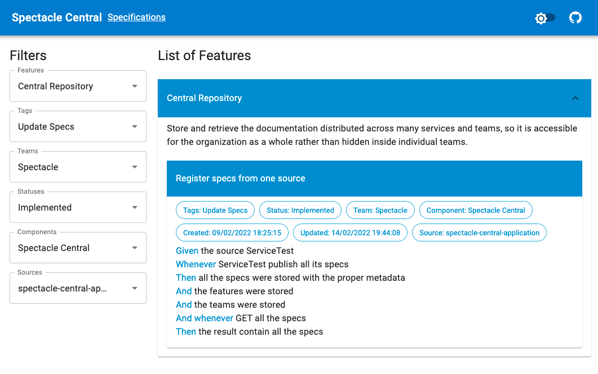

[](https://hub.docker.com/r/gianluigipp/spectacle-central)

# Spectacle Central

Repository for the living documentation generated by `Spectacle DSL`, it allows to centralize the
documentation generated from multiple executions of the `DSL` across multiple repositories, so even
though the docs are generated from multiple sources it can be queried from a central place which
increase the value for the organization as a whole.



## Features

* [Specifications Report](./docs/SpecificationsReport.md): Search and bookmark any specification
  published.
* [System Diagram](./docs/SystemDiagram.md): Visually show all the interactions in the system.

## Config

The service requires a `PostgreSql` database with a user with write permissions, it uses Flyway to
setup the schema and update it when upgrading to a newer version.

Environment Variables:

* `DATABASE_URL`: one variable holding all the connection detail using the
  format `USERNAME:PASSWORD@HOST:PORT/DATABASE`, additionally you can use the below `DATABASE_XXX`
  variables, if booth options are present the more specific variable take precedence.
* `DATABASE_HOST`
* `DATABASE_PORT`
* `DATABASE_NAME`
* `DATABASE_USERNAME`
* `DATABASE_PASSWORD`

## Run On-Premise

The Recommended way to install `Spectacle Central` in your organization is using the public Docker
Image in Docker Hub:

```
export DATABASE_URL=[YOUR_URL] 
docker run -p 8080:8080 -e DATABASE_URL --name spectacle-central gianluigipp/spectacle-central
```

## Build and Run

Run Server with UI:

```
export DATABASE_URL=[YOUR_URL] 
./gradlew run
```

Run Web UI only:

```
./gradlew jsBrowserRun --continuous
```

Build and Run in Docker:

```
export DATABASE_URL=[YOUR_URL] 
docker build -t spectacle-central . 
docker run -p 8080:8080 -e DATABASE_URL --name spectacle-central spectacle-central
```
