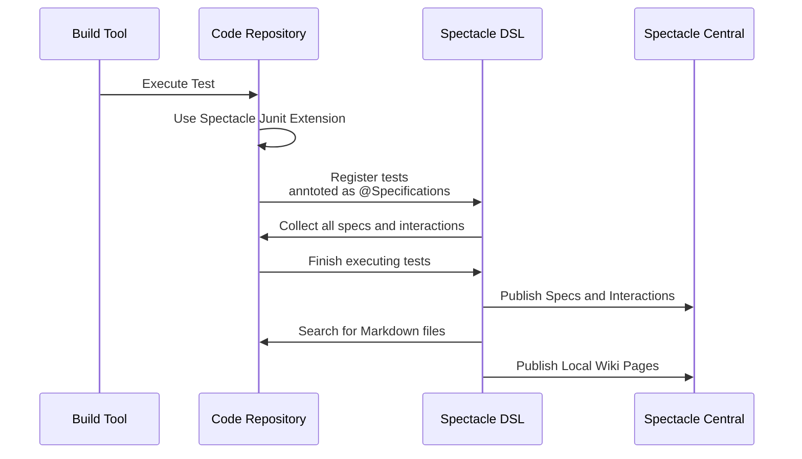

[//]: # ( {{ title: Overview }} )

# Spectacle DSL

A Kotlin multiplatform library for writing readable tests as specifications, it includes an
Assertion DSL and a BDD DSL, optionally you can publish your specs into the specs
repository `Spectacle Central`.

## How It Works

Lifecycle of the library.

